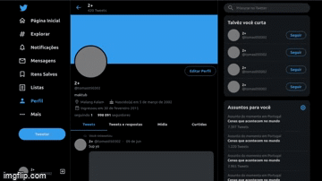

<h1 align="center">Welcome to Twitter Clone 👋</h1>
<p>
  
  <a href="https://twitter.com/tomas050302" target="_blank">
    
  </a>
</p>

> A Twitter Clone using ReactJS to test styled components and responsiveness

## Demo

<div align="center">
  
</div>

## Install

```sh
yarn
```

## Usage

```sh
yarn start
```

## Run tests

```sh
yarn run test
```

## Author

👤 **Tomás Lopes**

* Website: [tomaslopes.codes](https://tomaslopes.codes)
* Twitter: [@tomas050302](https://twitter.com/tomas050302)

## Show your support

Give a ⭐️ if this project helped you!

## Inspired by 

* [Rocketseat Video](https://www.youtube.com/watch?v=K-8z_4xvT3o)

## What I've learned

* Typescript
  * First Project with full TypeScript integration in React
    * Props Interface
  
* React Router DOM
  * Handle Routes
  * Dynamic styling according to route in side bar

* Styled components
  * Selectors
  * Variables
  * Encapsuling
  
* Responsiveness
  * Media queries
  * Displaying components accordingly to screen width

***
_This README was generated with ❤️ by [readme-md-generator](https://github.com/kefranabg/readme-md-generator)_
